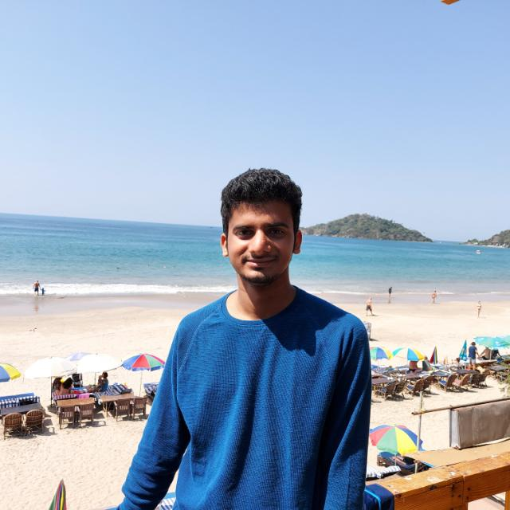

About
#####

:date: 2016-8-6 00:00
:slug: about
:status: published

Welcome to my blog!

I am **Chirag Jain** and I am currently in my final year of Computer Engineering course at Dwarkadas J. Sanghvi College of Engineering. I love programming challenges which make me scratch my head.

In the past two years, I have worked on several projects involving mobile apps with Android, iOS and web with Django and PHP. I have been to some hack-athons and won few of them. Recently I started exploring Machine Learning and have been reading up on Reinforcement Learning and NLP. You can find more about me with the social links on the left sidebar. My internet alias on most sites is "**chiragjn**".

I rarely write. I try my best to come up with something original to write about. This blog is a virtual space to park/dump my thoughts on Software and Life.

I am currently working with `Haptik`_ as a Machine Learning Intern.

I will be working with Media.net as a Web Developer beginning next year in July. You can read about my interview experience `here`_.

.. _`here` : /blog/media-net-interview-experience.html
.. _`Haptik`: http://haptik.co
